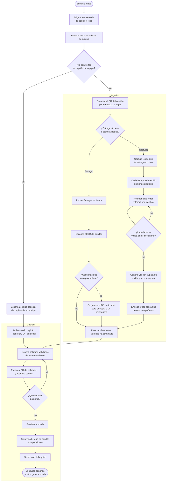

# SKRATICA (El Skrabble de ATICA)

Scrabble colaborativo para ATICA. Cada ronda dura **1 hora** y pasado ese tiempo se puede iniciar otra.

## Cómo empieza

Al entrar al juego se te asigna **aleatoriamente** un equipo y una **letra** (cada letra tiene una puntuación distinta). El número de equipos lo decide el administrador al generar la ronda (1, 2, 3 o 4 equipos).

## Roles

### Capitán
El equipo elige a un capitán. Para activar el rol debe escanear un **código QR especial** (pre-generado para cada equipo, ver [Códigos de capitán](#códigos-de-capitan) al final del documento). Su misión:
- **Da acceso a la ronda** al resto del equipo: los jugadores escanean su QR personal para empezar a jugar.
- Escanea los códigos QR de las palabras validadas por sus compañeros para sumar puntos.
- No descubre su letra hasta el final de la ronda.
- Cuando ya no queden más palabras que recopilar, **finaliza la ronda**. En ese momento se revela su letra y se suma su valor multiplicado por (1 + las veces que aparece en las palabras recopiladas).

### Jugador
Cada jugador tiene su letra y debe elegir **una sola vez** entre dos caminos:

- **Entregar** su letra a otro compañero para que forme una palabra. A partir de ahí actúa como observador y ya no puede capturar más letras.
- **Capturar** letras de otros compañeros para formar una palabra válida y entregarla al capitán.

## Cómo se juega paso a paso

1. **Elegir capitán** — Un miembro de cada equipo se ofrece como capitán, pulsa "Ser capitán" y escanea el **código QR especial** de su equipo (ver [Códigos de capitán](#códigos-de-capitan) al final del documento). No hay vuelta atrás.
2. **Escanear al capitán** — El resto del equipo escanea el QR del capitán para empezar a jugar.
3. **Entregar o capturar** — Decides si cedes tu letra o acumulas letras de otros. Esta decisión es **irreversible** durante la ronda.
   - **Entregar**: Pulsa **«Entregar mi letra»** y **escanea el QR del capitán**. Tras escanearlo aparecerá un diálogo de confirmación. Al confirmar, se genera un código QR con tu letra que puedes entregar a un compañero para que la capture. A partir de aquí actúas como observador.
   - **Capturar**: Pulsa **«Capturar letra»** para recoger las letras que te entreguen tus compañeros.
4. **Capturar letras** — Escanea los QR de las letras que te entreguen tus compañeros. Cada letra escaneada tiene un **30% de probabilidad** de recibir un **bonus aleatorio** (mayor cuanto más rápido se escanee):
   - **×2L / ×3L** — Duplica/triplica el valor de la letra.
   - **×2P / ×3P** — Duplica/triplica el valor total de la palabra.
   - Los bonus de letra se aplican **solo** en posición **impar** (×3) o **par** (×2). Los bonus de palabra igual.
5. **Formar la palabra** — Puedes reordenar tus letras como quieras y no estás obligado a usarlas todas para formar una palabra.
6. **Validar** — Si la palabra existe en el diccionario, se considera válida. Es igual de justo para todos.
7. **Entregar al capitán** — La palabra validada muestra un QR para que el capitán lo escanee.
8. **Entregar las sobrantes** — Las letras que no usaste se pueden volver a entregar a otros jugadores que sigan capturando. Si la letra tenía un bonus, **se pierde** al entregarla (la siguiente persona que la reciba podrá obtener un bonus nuevo).
9. **Finalizar la ronda** — El capitán puede finalizar la ronda cuando haya escaneado al menos una palabra. No puede hacerlo antes de **10 minutos** desde el inicio de la ronda (para evitar cierres accidentales).

## Puntuación final

Cuando el capitán da por terminada la ronda:
- Se suma la puntuación de todas las palabras recopiladas.
- Se revela la letra del capitán.
- Su valor se multiplica por (1 + número de veces que esa letra aparece en las palabras recopiladas). Por ejemplo, si la letra del capitán es la A (valor 1) y aparece 3 veces en las palabras del equipo, se suman 1 × (1 + 3) = 4 puntos.

El equipo con más puntos gana la ronda.

## Consejos

- **Entrega solo si estás seguro** de que alguien necesita tu letra. No hay vuelta atrás.
- **No captures sin un plan**. Asegúrate de poder formar una palabra antes de acumular letras.
- **No acumules de más**. Captura solo las que necesites; si sobran tras validar la palabra, puedes volver a entregarlas.

# Diagrama de flujo del juego

[Share FlowChart](https://kroki.io/mermaid/svg/Zmxvd2NoYXJ0IFRECiAgICBTVEFSVChbRW50cmFyIGFsIGp1ZWdvXSkgLS0-IEFTU0lHTltBc2lnbmFjacOzbiBhbGVhdG9yaWE8YnI-ZGUgZXF1aXBvIHkgbGV0cmFdCiAgICBBU1NJR04gLS0-IFNFQVJDSFtCdXNjYSBhIHR1cyBjb21wYcOxZXJvcyBkZSBlcXVpcG9dCiAgICBTRUFSQ0ggLS0-IENBUFRBSU5fREVDSVNJT057wr9UZSBjb252aWVydGVzPGJyPmVuIGNhcGl0w6FuIGRlIGVxdWlwbz99CgogICAgQ0FQVEFJTl9ERUNJU0lPTiAtLT58U8OtfCBTQ0FOX0NBUFRBSU5fS0VZW0VzY2FuZWEgY8OzZGlnbyBlc3BlY2lhbDxicj5kZSBjYXBpdMOhbiBkZSBzdSBlcXVpcG9dCiAgICBTQ0FOX0NBUFRBSU5fS0VZIC0tPiBCRUNPTUVfQ0FQVEFJTltBY3RpdmFyIG1vZG8gY2FwaXTDoW48YnI-LSBnZW5lcmEgdHUgUVIgcGVyc29uYWxdCiAgICBDQVBUQUlOX0RFQ0lTSU9OIC0tPnxOb3wgU0NBTl9DQVBUQUlOW0VzY2FuZWEgZWwgUVIgZGVsIGNhcGl0w6FuPGJyPnBhcmEgZW1wZXphciBhIGp1Z2FyXQoKICAgIHN1YmdyYXBoIENhcGl0w6FuCiAgICAgICAgQkVDT01FX0NBUFRBSU4gLS0-IFdBSVRbRXNwZXJhIHBhbGFicmFzIHZhbGlkYWRhczxicj5kZSB0dXMgY29tcGHDsWVyb3NdCiAgICAgICAgV0FJVCAtLT4gU0NBTl9XT1JEW0VzY2FuZWEgUVIgZGUgcGFsYWJyYXM8YnI-eSBhY3VtdWxhIHB1bnRvc10KICAgICAgICBTQ0FOX1dPUkQgLS0-IE1PUkV7wr9RdWVkYW4gbcOhczxicj5wYWxhYnJhcz99CiAgICAgICAgTU9SRSAtLT58U8OtfCBXQUlUCiAgICAgICAgTU9SRSAtLT58Tm98IEZJTklTSFtGaW5hbGl6YXIgbGEgcm9uZGFdCiAgICAgICAgRklOSVNIIC0tPiBSRVZFQUxbU2UgcmV2ZWxhIHR1IGxldHJhIGRlIGNhcGl0w6FuPGJyPsOXTiBhcGFyaWNpb25lc10KICAgICAgICBSRVZFQUwgLS0-IFRPVEFMW1N1bWEgdG90YWwgZGVsIGVxdWlwb10KICAgICAgICBUT1RBTCAtLT4gV0lOKFtFbCBlcXVpcG8gY29uIG3DoXM8YnI-cHVudG9zIGdhbmEgbGEgcm9uZGFdKQogICAgZW5kCgogICAgc3ViZ3JhcGggSnVnYWRvcgogICAgICAgIFNDQU5fQ0FQVEFJTiAtLT4gREVDSURFe8K_RW50cmVnYXMgdHUgbGV0cmE8YnI-byBjYXB0dXJhcyBsZXRyYXM_fQogICAgICAgIERFQ0lERSAtLT58RW50cmVnYXJ8IEJUTltQdWxzYSDCq0VudHJlZ2FyIG1pIGxldHJhwrtdCiAgICAgICAgQlROIC0tPiBSRVNDQU5fQ0FQVEFJTltFc2NhbmVhIGVsIFFSIGRlbCBjYXBpdMOhbl0KICAgICAgICBSRVNDQU5fQ0FQVEFJTiAtLT4gQ09ORklSTXvCv0NvbmZpcm1hcyBxdWU8YnI-ZW50cmVnYXMgdHUgbGV0cmE_fQogICAgICAgIENPTkZJUk0gLS0-fE5vfCBPQlNFUlZFUgogICAgICAgIENPTkZJUk0gLS0-fFPDrXwgU0hBUkVbU2UgZ2VuZXJhIGVsIFFSIGRlIHR1IGxldHJhPGJyPnBhcmEgY29tcGFydGlyIGNvbiB1biBjb21wYcOxZXJvXQogICAgICAgIFNIQVJFIC0tPiBPQlNFUlZFUltQYXNhcyBhIG9ic2VydmFkb3I8YnI-LSB0dSByb25kYSBoYSB0ZXJtaW5hZG9dCiAgICAgICAgREVDSURFIC0tPnxDYXB0dXJhcnwgQ09MTEVDVFtDYXB0dXJhIGxldHJhcyBxdWU8YnI-dGUgZW50cmVndWVuIG90cm9zXQogICAgICAgIENPTExFQ1QgLS0-IEJPTlVTW0NhZGEgbGV0cmEgcHVlZGUgcmVjaWJpcjxicj51biBib251cyBhbGVhdG9yaW9dCiAgICAgICAgQk9OVVMgLS0-IFJFT1JERVJbUmVvcmRlbmEgbGFzIGxldHJhczxicj55IGZvcm1hIHVuYSBwYWxhYnJhXQogICAgICAgIFJFT1JERVIgLS0-IFZBTElEQVRFe8K_TGEgcGFsYWJyYSBlczxicj52w6FsaWRhIGVuIGVsIGRpY2Npb25hcmlvP30KICAgICAgICBWQUxJREFURSAtLT58Tm98IFJFT1JERVIKICAgICAgICBWQUxJREFURSAtLT58U8OtfCBERUxJVkVSW0dlbmVyYSBRUiBjb24gbGEgcGFsYWJyYTxicj52w6FsaWRhIHkgc3UgcHVudHVhY2nDs25dCiAgICAgICAgREVMSVZFUiAtLT4gU1VSUExVU1tFbnRyZWdhIGxldHJhcyBzb2JyYW50ZXM8YnI-YSBvdHJvcyBjb21wYcOxZXJvc10KICAgICAgICBTVVJQTFVTIC0tPiBPQlNFUlZFUgogICAgZW5kCgogICAgT0JTRVJWRVIgLS0-IFdBSVQ)

# Iniciar partida

## 1 equipo
[Iniciar Ronda 1 Equipo](https://juanjmerono.github.io/skratica/?teams=1)

## 2 equipos
[Iniciar Ronda 2 Equipos](https://juanjmerono.github.io/skratica/?teams=2)

## 3 equipos
[Iniciar Ronda 3 Equipos](https://juanjmerono.github.io/skratica/?teams=3)

## 4 equipos
[Iniciar Ronda 4 Equipos](https://juanjmerono.github.io/skratica/?teams=4)

# Pruebas

Utiliza esta página para probar el juego.

[Test Game](https://juanjmerono.github.io/skratica/test.html)

# Códigos de capitan

## Equipo Azul

[Ser capitán azul](https://juanjmerono.github.io/skratica/?pass=YXp1bA==)

## Equipo Rojo

[Ser capitán rojo](https://juanjmerono.github.io/skratica/?pass=cm9qbw==)

## Equipo Verde

[Ser capitán rojo](https://juanjmerono.github.io/skratica/?pass=dmVyZGU=)

## Equipo Amarillo

[Ser capitán amarillo](https://juanjmerono.github.io/skratica/?pass=YW1hcmlsbG8=)

