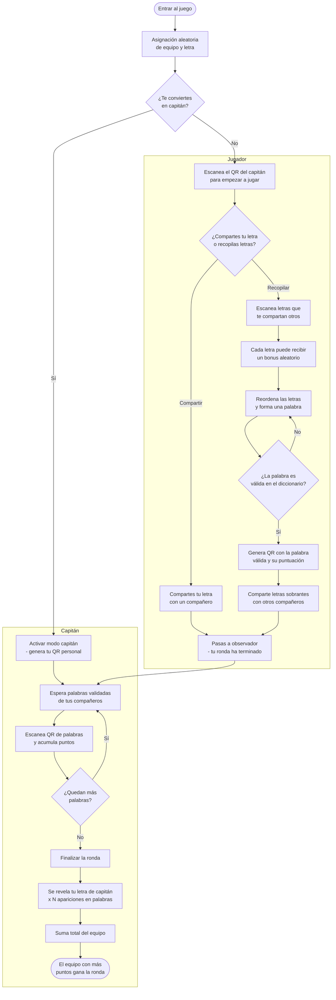

# SKRATICA (El Skrabble de ATICA)

Scrabble colaborativo para ATICA. Cada ronda dura **1 hora** y pasado ese tiempo se puede iniciar otra.

## Cómo empieza

Al entrar al juego se te asigna **aleatoriamente** un equipo y una **ficha con una letra** (cada letra tiene una puntuación distinta). El número de equipos lo decide el administrador al generar la ronda (2, 3 o 4 equipos).

## Roles

### Capitán
El equipo elige a un capitán. Su misión:
- **Da acceso a la ronda** al resto del equipo: los jugadores escanean su QR para empezar a jugar.
- Escanea los códigos QR de las palabras validadas por sus compañeros para sumar puntos.
- No descubre su letra hasta el final de la ronda.
- Cuando ya no queden más palabras que recopilar, **finaliza la ronda**. En ese momento se revela su letra y se suma su valor multiplicado por las veces que aparece en las palabras recopiladas.

### Jugador
Cada jugador tiene su letra y debe elegir **una sola vez** entre dos caminos:

- **Compartir** su letra con otro compañero para que forme una palabra. A partir de ahí actúa como observador y ya no puede recopilar más letras.
- **Recopilar** letras de otros compañeros para formar una palabra válida y entregarla al capitán.

## Cómo se juega paso a paso

1. **Elegir capitán** — Un miembro de cada equipo se ofrece como capitán y pulsa el botón que le asigna ese rol, sin vuelta atrás.
2. **Escanear al capitán** — El resto del equipo escanea el QR del capitán para empezar a jugar.
2. **Compartir o recopilar** — Decides si cedes tu letra o acumulas letras de otros. Esta decisión es **irreversible** durante la ronda.
3. **Recopilar letras** — Escanea los QR de las letras que te compartan tus compañeros. Cada letra escaneada puede recibir un **bonus aleatorio**:
   - **×2L / ×3L** — Duplica/triplica el valor de la letra.
   - **×2P / ×3P** — Duplica/triplica el valor total de la palabra.
   - Los bonus de letra se aplican **solo** en posición **impar** (×3) o **par** (×2). Los bonus de palabra igual.
4. **Formar la palabra** — Puedes reordenar tus letras como quieras y no estás obligado a usarlas todas para formar una palabra.
5. **Validar** — Si la palabra existe en el diccionario, se considera válida. Es igual de justo para todos.
6. **Entregar al capitán** — La palabra validada muestra un QR para que el capitán lo escanee.
7. **Compartir sobrantes** — Las letras que no usaste se pueden volver a compartir con otros jugadores que sigan recopilando. Si la letra tenía un bonus, **se pierde** al compartirla (la siguiente persona que la reciba podrá obtener un bonus nuevo).

## Puntuación final

Cuando el capitán da por terminada la ronda:
- Se suma la puntuación de todas las palabras recopiladas.
- Se revela la letra del capitán.
- Su valor se multiplica por el número de veces que esa letra aparece en las palabras recopiladas y se añade al total.

El equipo con más puntos gana la ronda.

## Consejos

- **Comparte solo si estás seguro** de que alguien necesita tu letra. No hay vuelta atrás.
- **No recopiles sin un plan**. Asegúrate de poder formar una palabra antes de acumular letras.
- **No acumules de más**. Recopila solo las que necesites; si sobran tras validar la palabra, puedes volver a compartirlas.

# Diagrama de flujo del juego

# Iniciar partida

## 2 equipos
[Iniciar Ronda 2 Equipos](https://juanjmerono.github.io/skratica/?teams=2)

## 3 equipos
[Iniciar Ronda 3 Equipos](https://juanjmerono.github.io/skratica/?teams=3)

## 4 equipos
[Iniciar Ronda 4 Equipos](https://juanjmerono.github.io/skratica/?teams=4)

# Pruebas

Utiliza esta página para probar el juego.

[Test Game](https://juanjmerono.github.io/skratica/test.html)
